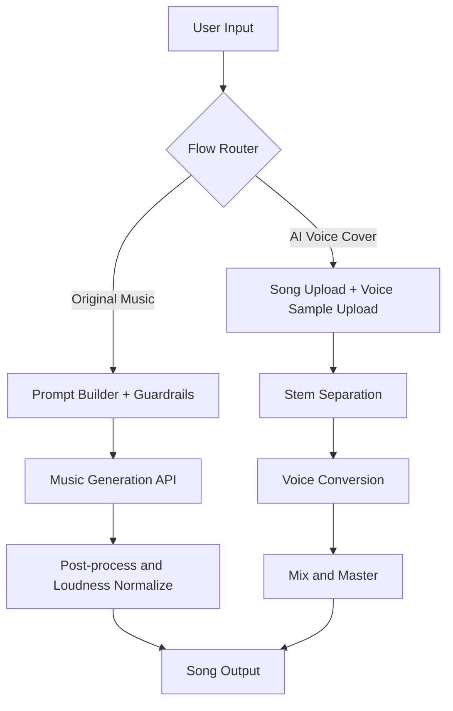

# Q3 - High-Level Generation Pipeline Design

## Objective

Design one pipeline that supports both:

1. Original AI music generation
2. AI voice/cover generation

The pipeline must start with user input and end with song output while handling different flows cleanly.

## 1) End-to-end flow (Mermaid)



## 2) Pipeline components

### Shared components

- Input validation
  - Required fields, duration checks, URL/file checks
- Safety and policy checks
  - Prompt moderation, voice consent checks, rights checks
- Job orchestration
  - Async queue, retries, timeout control
- Storage and delivery
  - Object storage for stems/output, signed URLs for client delivery
- Analytics and feedback loop
  - Track generation success, user rating, retries, cost per job

### Original music generation path

1. Parse user prompt and optional lyrics/inspiration.
2. Build normalized model prompt.
3. Call music-generation provider.
4. Optional vocal generation layer (if model does not support vocals natively).
5. Normalize loudness and export.

### AI voice/cover path

1. Accept source song and voice sample.
2. Separate song into stems (vocals/instrumental).
3. Convert vocal stem to target voice identity.
4. Preserve melody and timing constraints.
5. Mix converted vocal with instrumental and master final output.

## 3) Data contracts (simplified)

### Original music request

```json
{
  "prompt": "Catchy early-2000s pop anthem",
  "mood": "upbeat",
  "genre": "pop",
  "style": "early 2000s",
  "duration_sec": 120,
  "lyrics": "optional",
  "inspiration": "optional",
  "include_vocals": true
}
```

### Voice cover request

```json
{
  "source_song_url": "https://example.com/song.wav",
  "voice_sample_url": "https://example.com/voice.wav",
  "target_voice_label": "female_pop_voice_v1",
  "preserve_timing": true,
  "preserve_melody": true
}
```

### Unified response

```json
{
  "flow": "original_music_generation",
  "output_url": "https://...",
  "estimated_cost_usd": 0.56,
  "quality_score": 0.88,
  "steps": [
    {"name": "input_validation", "status": "ok", "detail": "..."}
  ]
}
```

## 4) Why this design is product-friendly

- Simple user experience: one product, two modes, one consistent output object.
- Cost-aware routing: choose model/provider based on request type and user tier.
- Scalable operations: async jobs + retries + observable step-level states.
- Continuous improvement: user ratings can be mapped back to prompt/model settings.

## 5) Mapping to this repo

- Pipeline implementation: `src/main.py`
- Mock provider adapters: `src/mock_services.py`
- Unit tests:
  - `tests/test_music_gen.py`
  - `tests/test_voice_cover.py`
